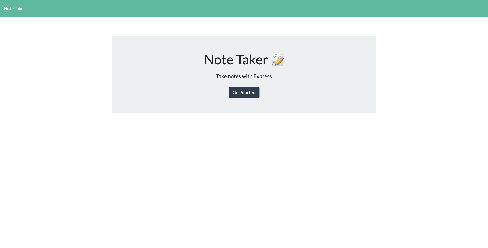
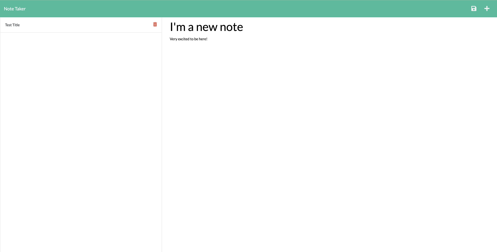
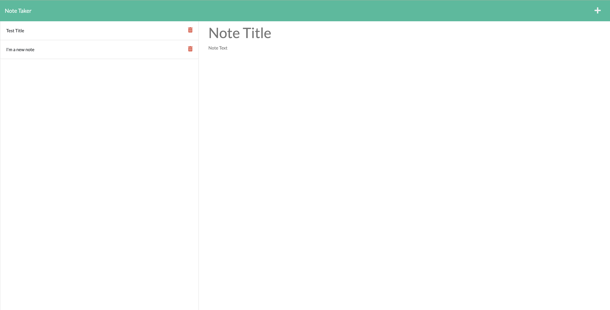

# Note taker

## Table of Contents

This project is cusing the MIT license. 
    
- [Description](#description)
- [Usage](#usage)
- [Credits](#credits)

- [Questions](#questions)

## Description
A simple note taking app using Express. 
This was one of my first projects working with routes and Express in general. 

## Usage
Fill out both the title and body section of the note. In the top right corner, a save button should appear if both fields are not empty. 

Click on the save button to save your note to the left panel

If desired, from here you can click the red trashcan icon to delete the note. 

## Credits
This was created as an assignmnent for Georgia Tech Bootcamp

## Questions

If you have additional questions, you can reach me here:

[Github Profile](https://github.com/lauraantunez024)

My Email: Lauraantunez024@gmail.com

Link to deployed application or link to video to view:
https://protected-harbor-26088.herokuapp.com/

